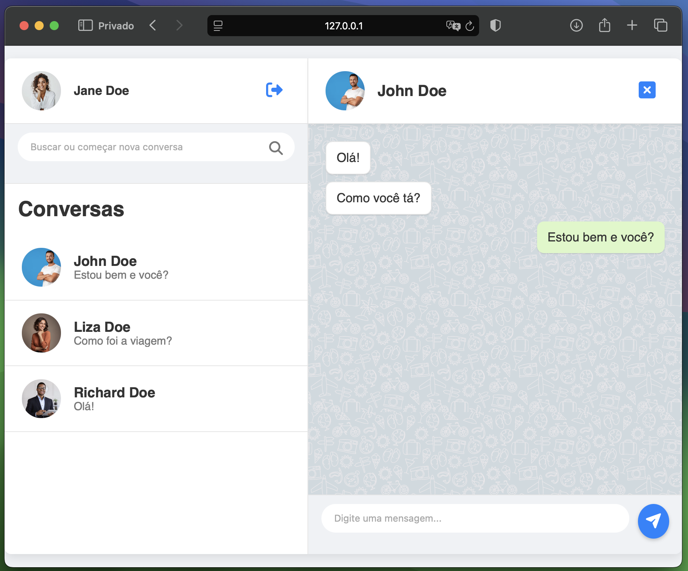

# Chatter — Sistema de Mensagens em Tempo Real


Este projeto é uma aplicação de chat em tempo real construída com Node.js utilizando TypeScript, Express, MongoDB, Socket.IO e JavaScript puro no frontend. Ele permite que usuários se autentiquem, enviem mensagens, visualizem conversas e recebam atualizações instantâneas.



# Funcionalidades

- Autenticação com JWT
- Busca de usuários por número de telefone
- Lista de conversas
- Envio e recebimento de mensagens em tempo real
- Atualização automática da lista de conversas ao receber nova mensagem
- Upload de imagem de perfil
- Interface responsiva e leve

# Estrutura do Projeto

```plaintext
backend/
 ┣---src/
 ┃ ┃---config/
 ┃ ┃ ┗---database.ts
 ┃ ┣---controllers/
 ┃ ┃ ┣---auth.controller.ts
 ┃ ┃ ┃---conversation.controller.ts
 ┃ ┃ ┃---message.controller.ts
 ┃ ┃ ┗---user.controller.ts
 ┃ ┣---middlewares/
 ┃ ┃ ┗---authenticate.middleware.ts
 ┃ ┣---models/
 ┃ ┃ ┣---conversation.model.ts
 ┃ ┃ ┣---message.model.ts
 ┃ ┃ ┗---user.model.ts
 ┃ ┣---routes/
 ┃ ┃ ┣---auth.route.ts
 ┃ ┃ ┣---conversation.route.ts
 ┃ ┃ ┣---message.route.ts
 ┃ ┃ ┗---user.route.ts
 ┃ ┣---schemas/
 ┃ ┃ ┣---auth.schema.ts
 ┃ ┃ ┗---message.schema.ts
 ┃ ┣---services/
 ┃ ┃ ┗---conversation.service.ts
 ┃ ┣---utils/
 ┃ ┃ ┣---jwt.util.ts
 ┃ ┃ ┣---storage.util.ts
 ┃ ┃ ┗---user.request.util.ts
 ┃ ┣---web/
 ┃ ┃ ┗---socket.ts
 ┃ ┣---app.ts
 ┃ ┗---server.ts
 ┣---uploads/

frontend/
 ┃---css/
 ┃ ┗---styles.css
 ┃---html/
 ┃ ┣---auth.html
 ┃ ┗---index.html
 ┃---img/
 ┃ ┗---default-profile.jpg
 ┃---js/
 ┃ ┣---auth.js
 ┃ ┗---index.js

```

# Tecnologias Utilizadas

- Node.js (TypeScript) + Express
- MongoDB + Mongoose
- Socket.IO
- JWT para autenticação
- JavaScript no frontend
- HTML/CSS para interface
- dotenv para variáveis de ambiente

# Instalação

## 1. Clone o repositório

```bash
git clone https://github.com/seu-usuario/chatapp.git
cd chatapp
```

## 2. Instale as dependências

```bash
npm install
```

## 3. Configure o .env

Crie um arquivo .env na raiz com:

```javascript
MONGO_URI=mongodb://localhost:27017/chatapp
JWT_SECRET=sua_chave_secreta
EXPRESS_PORT=3100
SOCKET_PORT=8100
```

## 4. Inicie os servidores

```bash
npm run dev
```

# Rodando com Docker (Em andamento)

Este projeto pode ser executado facilmente com Docker, permitindo um ambiente isolado e consistente para desenvolvimento e produção.

## Como rodar

```bash
docker-compose up --build
```

# Upload de imagem

Imagens de perfil são armazenadas na pasta /uploads e servidas via rota estática:

```javascript
app.use("/uploads", express.static(path.join(__dirname, "..", "uploads")));
```

# Segurança

- Autenticação via JWT
- Proteção de rotas com middleware authenticateToken
- Validação de entrada e controle de acesso por ID

# Contribuições

Sinta-se à vontade para abrir issues, enviar PRs ou sugerir melhorias. Este projeto é feito para aprendizado e evolução contínua.
